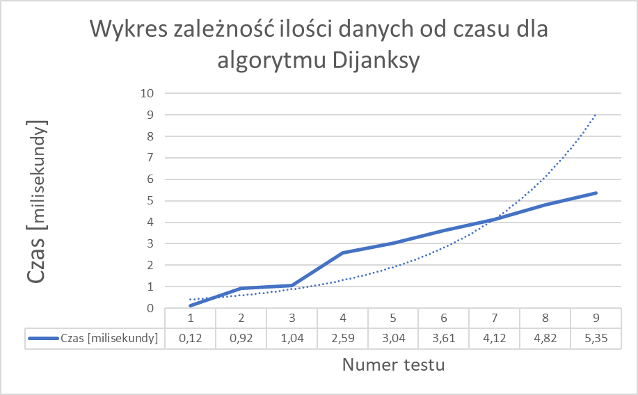

# ALGORYTM DIJKSTRY

## Akademia Finansów i Biznesu Vistula
## Kierunek studiów - Informatyka

  Algorytm Dijkstry jest znany jako algorytm najkrótszej ścieżki z jednego źródła. Służy do znajdowania najkrótszych ścieżek między węzłami na wykresie, które mogą reprezentować na przykład sieci drogowe. Został opracowany przez Edsger W. Dijkstra w 1956 roku i opublikowany trzy lata później.
Najkrótszą ścieżkę możemy znaleźć, korzystając z algorytmu przeszukiwania szerokości pierwszego wyszukiwania (BFS). Ten algorytm działa dobrze, ale problem polega na tym, że zakłada on, że koszt przejścia każdej ścieżki jest taki sam, co oznacza, że koszt każdej krawędzi jest taki sam. Algorytm Dijkstry pomaga nam znaleźć najkrótszą ścieżkę, w której koszt każdej ścieżki nie jest taki sam. Wyznacza najkrótsze ścieżki z jednego wierzchołka (zwanego wierzchołkiem źródłowym) do pozostałych wierzchołków. Algorytm wymaga, aby wagi krawędzi grafu nie były ujemne.
Algorytm realizuje podejście zachłanne. W każdej iteracji wybierany jest ten spośród nieodwiedzonych wierzchołków, do którego można dotrzeć najmniejszym kosztem. Po wyznaczeniu ścieżki do konkretnego wierzchołka nie zostanie ona zmodyfikowana w trakcie wykonywania dalszej części algorytmu.

Złożoność algorytmu Dijkstry 
	Złożoność czasu 	  
	Najwydajniejszy	O(n*log n) 
	Najgorszy 	O(n 2 )  
	Złożoność przestrzeni 	O(n)  

1. Złożoność czasowa 
Złożoność najgorszego przypadku [Big-O] : O(n2) Oznaczmy liczbę wierzchołków przez n, a liczbę krawędzi przez e. Każda krawędź będzie analizowana jeden raz w przypadku grafu skierowanego lub dwa razy w przypadku grafu nieskierowanego. Oprócz analizy krawędzi w trakcie wykonywania algorytmu n razy przeszukuje się zbiór Q. W przypadku przechowywania zbioru Q w zwykłej tablicy wyszukanie wierzchołka odbywa się w czasie liniowym (O(n)). Wówczas złożoność czasowa algorytmu to O(n2+e). Biorąc pod uwagę, że w przypadku braku krawędzi wielokrotnych liczba krawędzi jest zawsze mniejsza od n2, można powiedzieć, że złożoność czasowa algorytmu to O(n2).
Złożoność najlepszego przypadku [Big-omega] : O(n*log n) Jeśli zbiór Q będziemy przechowywać w postaci kopca, wyszukiwanie elementu będzie się odbywało w czasie O(logn). Jednak po każdej zmianie kosztu dotarcia do wierzchołka trzeba przebudować kopiec, co również odbywa się w czasie O(logn). Złożoność obliczeniowa algorytmu wyniesie wówczas O(elogn). Dla grafów rzadkich (liczba krawędzi mniejsza pod względem rzędu wielkości od n2/logn) jest to zatem rozwiązanie szybsze, ale dla grafów gęstych – wolniejsze. Jeśli do przechowywania zbioru Q zastosujemy kopiec Fibonacciego, złożoność obliczeniowa algorytmu zmniejszy się do O(nlogn+e).
Podsumowując:
Wyszukiwanie liniowe - cały algorytm będzie miał czasową złożoność obliczeniową klasy O ( n 2 )
Użycie kolejki priorytetowej - podstawowym zyskiem zastosowania kolejki priorytetowej w algorytmie Dijkstry jest zmniejszenie klasy złożoności obliczeniowej z O ( n 2 ) na O ( n log n ). Jednakże z drugiej strony sam algorytm się komplikuje i rośnie zapotrzebowanie na pamięć. Dlatego dla małych grafów wciąż efektywnym rozwiązaniem może być wersja z wyszukiwaniem liniowym.

 
2. Złożoność przestrzeni 
Złożoność przestrzeni dla algorytmu Dijkstry to O(log n). 

3. Wyniki testów wykonania algorytmu w czasie

Tabela. Wynik testów dla algorytmu Dijkstry  
Ilość [wierzchołków : ścieżek : najdłuższa ścieżka]	Numer testu	Czas [milisekundy]  
50 : 1225 : 50	1	0,12 
100 : 4950 : 50	2	0,92 
150 : 11175 : 50	3	1,04 
200 : 19900 : 50	4	2,59 
250 : 31125 : 50	5	3,04 
300 : 44850 : 50	6	3,61 
350 : 61075 : 50	7	4,12 
400 : 79800 : 50	8	4,82 
450 : 101025 : 50	9	5,35 

OPIS PROGRAMU 

Program napisany w języku Java dla reprezentowanego grafu za pomocą macierzy sąsiedztwa. Pobiera on dane od użytkownika poprzez konsole (ilość wierzchołków, ilość połączeń między nimi – program informuje o minimalnej oraz maksymalnej granicy i maksymalnej wartości dla ścieżki pomiędzy wierzchołkami) i tworzy macierz kwadratową. 
Ilość ścieżek ma ustawioną granicę minimalną – jest to wpisana przez użytkownika ilość wierzchołków i wartość ta jest wymagana do utworzenia macierzy kwadratowej. Dla granicy maksymalnej zastosowałam wzór n(n – 3) / 2, który ustala ile maksymalnie może pojawić się niezdublowanych połączeń pomiędzy wszystkimi wierzchołkami w danym grafie. Odległości pomiędzy wierzchołkami są ustawiane losowo ale uwzględniając maksymalną wartość dla najdłuższej. Po podaniu wszystkich niezbędnych danych program uruchamia algorytm Dijkstry, który szuka najkrótszej ścieżka z jednego źródła. Użytkownik może wybrać czy niektóre z etapów tworzenia się grafu mają zostać wyświetlone, czy też przechodzimy do wyświetlenia wyniku końcowego.

Program posiada dwie klasy:

Graph – pobiera dane od użytkownika i tworzy macierz kwadratową. 
DijkstrasAlgorithm – wykonuje i wyświetla wynik algorytmu Dijkstry 

Ma złożoność czasową O(V^2)O(V2) przy użyciu reprezentacji grafu w postaci macierzy sąsiedztwa. Złożoność czasową można zredukować do O((V+E)logV)O((V+E)logV) za pomocą reprezentacji grafu w formie listy sąsiedztwa, gdzie E to liczba krawędzi grafu, a V to liczba wierzchołków grafu wykres. Czas na odwiedzenie wszystkich wierzchołków =O(V+E). Czas potrzebny na przetworzenie jednego wierzchołka=O(logV). Czas potrzebny na odwiedzenie i przetworzenie wszystkich wierzchołków = O(V+E)*O(logV) = O((V+E)logV). Złożoność przestrzeni w tym przypadku również poprawi się do O(V), ponieważ zarówno lista sąsiedztwa, jak i kopia min wymagają przestrzeni O(V). Tak więc całkowita złożoność przestrzeni staje się O(V)+O(V)=O(2V) = O(V)

Instrukcja uruchamiania programu: 
Program można uruchomić za pośrednictwem IDE (Integrated Development Environment), czyli zintegrowanego środowiska programistycznego (np. Intellij IDEA) lub w CLI (Command Line Interface), czyli w wierszu poleceń / terminalu.  

Uruchamianie z poziomu CLI: 

Krok 1.  
Na początek należy upewnić się, że mamy zainstalowaną Jave na naszym systemie operacyjnym (instrukcja będzie pokazana dla systemu Windows 11). W tym celu należy przejść do CLI i wpisać komendę java -version  
Jeśli pojawi się komunikat z podaną wersją, możemy przejść do kroku 2, a dla komunikatu z błędem należy najpierw upewnić się czy JDK (zalecam przynajmniej wersję 18 i nowsze) zostało prawidłowo zainstalowane (można pobrać za darmo z https://www.oracle.com/java/technologies/downloads/) a następnie wykonać następującą konfigurację aby nasz system polecenia java / javac mógł wykonać globalnie z dowolnej ścieżki systemowej: 
 
Krok 2.  
Uruchamiamy CLI i przechodzimy do ścieżki, w której znajduje się program   
•	Przejdź do folderu src – cd src  
•	Wykonaj kompilację kodu java – javac ./DijkstrasAlgorithm.java ./Graph.java  
•	Uruchom skompilowany program – java DijkstrasAlgorithm 
•	Gotowe, dalej postępuj zgodnie z instrukcją programu  

<pre>
Wprowadź liczbę wierzchołków: 6
Wprowadź liczbę połączeń między wierzchołkami: 18
Maksymalna wartość to 15. Wprowadź liczbę połączeń między wierzchołkami: 2
Minimalna wartość to 6. Wprowadź liczbę połączeń między wierzchołkami: 12
Wprowadź maksymalną możliwą wartość dla dystansu między wierzchołkami: 25
Wyświetlić dane grafu oraz powstałej macierzy? (true / false) true

1 - 5 : 8
2 - 4 : 23
3 - 6 : 25
4 - 3 : 16
5 - 2 : 18
6 - 1 : 24
6 - 2 : 8
3 - 2 : 20
4 - 6 : 16
5 - 3 : 4
6 - 5 : 12
4 - 1 : 3
1 - 4 : 3
5 - 6 : 12
3 - 5 : 4
6 - 4 : 16
2 - 3 : 20
2 - 6 : 8
1 - 6 : 24
2 - 5 : 18
3 - 4 : 16
6 - 3 : 25
4 - 2 : 23
5 - 1 : 8

matrix = [
  [ 0 0 0 3 8 24 ]
  [ 0 0 20 23 18 8 ]
  [ 0 20 0 16 4 25 ]
  [ 3 23 16 0 0 16 ]
  [ 8 18 4 0 0 12 ]
  [ 24 8 25 16 12 0 ]
]

Czas wykonania w nanosekundach: 4100
Czas wykonania w milisekundach: 0,00

Wierzchołki     Dystans         Ścieżka
0 -> 1           26              0 3 1
0 -> 2           12              0 4 2
0 -> 3           3               0 3
0 -> 4           8               0 4
0 -> 5           19              0 3 5
</pre>

Bibliografia
T.H. Cormen, Ch.E. Leiserson, R.L. Rivest, C. Stein, Wprowadzenie do algorytmów, Wydawnictwo Naukowe PWN, Warszawa, 2012, ISBN 9788301169114.
